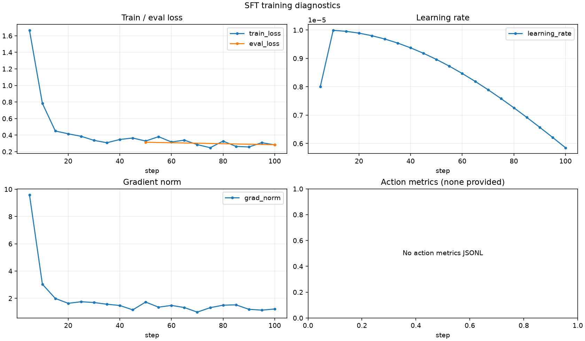

# SFT Training Report

This report contains numeric metrics extracted from the trainer log.

## Run overview

| Metric | Value |
| --- | ---: |
| Latest step | 100 / 216 |
| Progress | 46.3% |
| Latest epoch | 0.925926 |
| Train runtime | - |
| Steps / second | - |
| Estimated remaining | - |

## Metric summary

| Series | Count | First | Best/min | Latest |
| --- | ---: | ---: | ---: | ---: |
| train_loss | 20 | 1.6662 | 0.2479 | 0.2822 |
| eval_loss | 2 | 0.314097 | 0.284129 | 0.284129 |
| learning_rate | 20 | 8e-06 | 5.85194e-06 | 5.85194e-06 |
| grad_norm | 20 | 9.59892 | 0.988883 | 1.21778 |

## Action metrics

No action metrics were provided.
